# InteractHub

> A modern social networking platform built with ASP.NET Core Web API and React + TypeScript.

[](https://nice-wave-00bd20700.7.azurestaticapps.net/)
[](#technology-stack)
[](#technology-stack)
[](#database-deliverables)

## Live Demo

- Historical production website: https://nice-wave-00bd20700.7.azurestaticapps.net/
- Current status: domain is no longer active because the Azure free trial has ended.
- Deployment proof screenshots:
  - Azure Static Web App:

    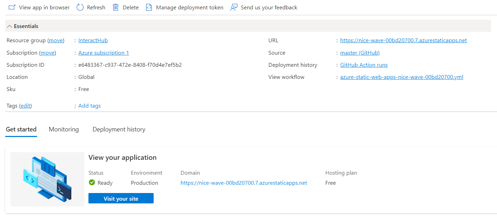

  - Azure App Service (Web App API):

    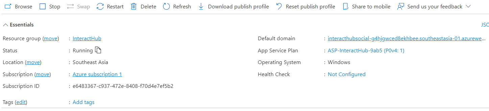

## Table of Contents

1. [Project Overview](#project-overview)
2. [Technology Stack](#technology-stack)
3. [Architecture and Flow](#architecture-and-flow)
4. [Key Features](#key-features)
5. [Screenshots](#screenshots-collected-in-interacthub-clientsrcassets)
6. [Setup and Installation](#setup-and-installation)
7. [Database Diagram](#database-diagram)
8. [API Endpoints](#api-endpoints)
9. [Database Deliverables](#database-deliverables)
10. [Testing](#testing)
11. [Deployment](#deployment)
12. [Submission Checklist](#submission-checklist)

## Project Overview

InteractHub is a full-stack social media project focused on practical real-world capabilities: secure authentication, scalable API design, social graph interactions, real-time notifications, media upload, and moderation workflows.

## Technology Stack

### Core Technologies

| Layer | Technologies |
|---|---|
| Frontend |      |
| Backend |     |
| Database |  |
| Auth |  |
| Cloud/Deployment |   |

### Engineering Highlights

- Layered backend architecture with Services, Repositories, DTOs, and Controllers.
- JWT-secured REST API with role-based authorization for admin routes.
- Real-time notification delivery via SignalR hub.
- EF Core migrations and seed strategy for reproducible database provisioning.
- Production-ready deployment path documented for Azure.

## Architecture and Flow

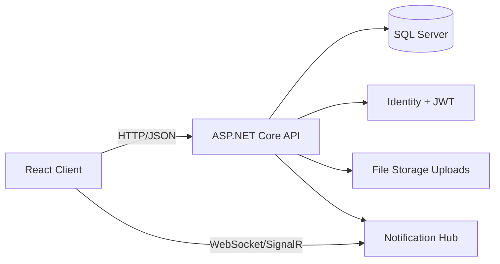

## Key Features

- User registration and login with JWT authentication.
- Profile view and profile update.
- News feed with pagination.
- Create, update, delete, like, comment, share, and report posts.
- Friend request flow (send, accept, decline, remove).
- Story posting and story expiration flow.
- Notifications and real-time updates with SignalR.
- Admin moderation endpoints for reports and post removal.
- Image upload endpoint for media attachments.

## Screenshots (Collected in interacthub-client/src/assets)

> Source folder: interacthub-client/src/assets

### Authentication
- Sign In

  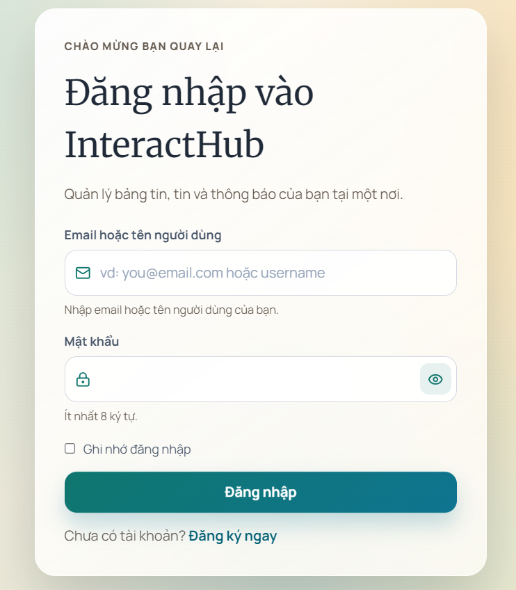

- Register

  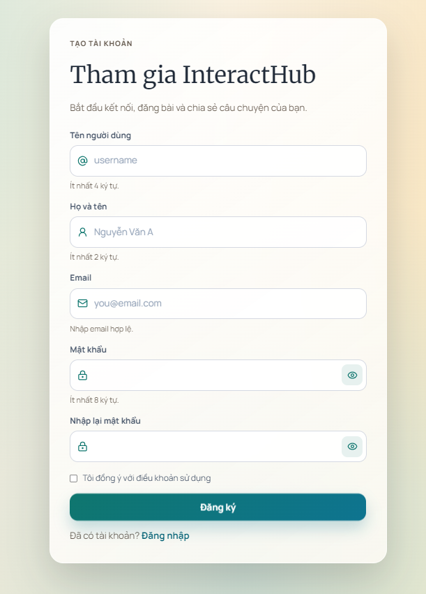

### Home and Feed
- Homepage

  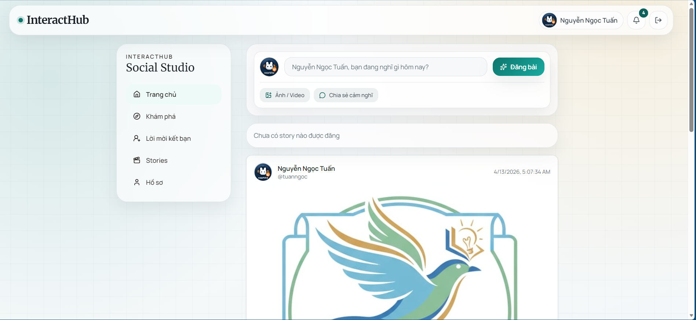

- Homepage responsive

  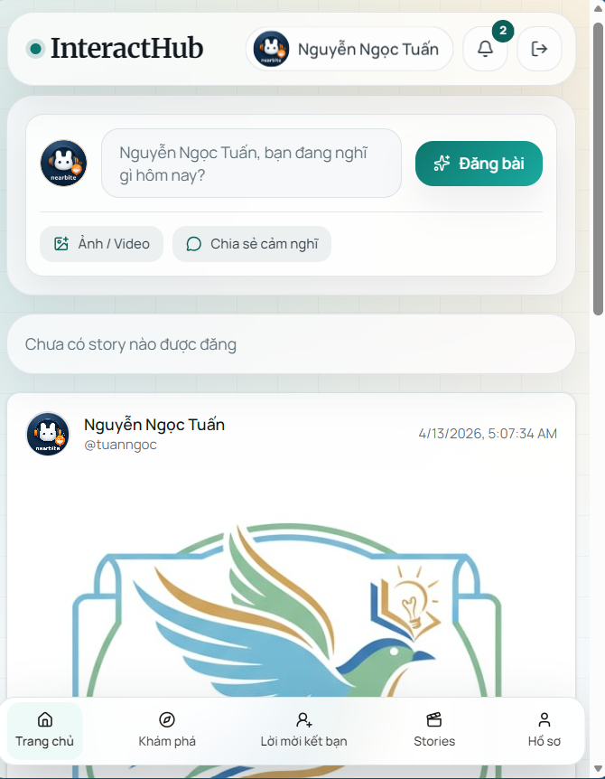

- Single post

  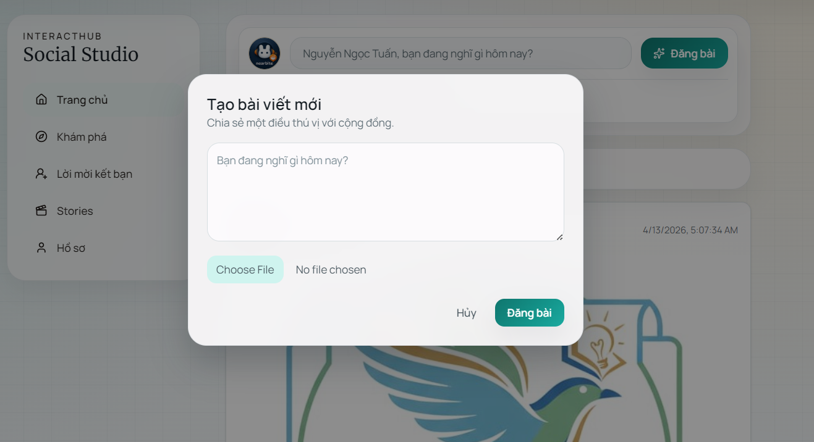

- Post grid

  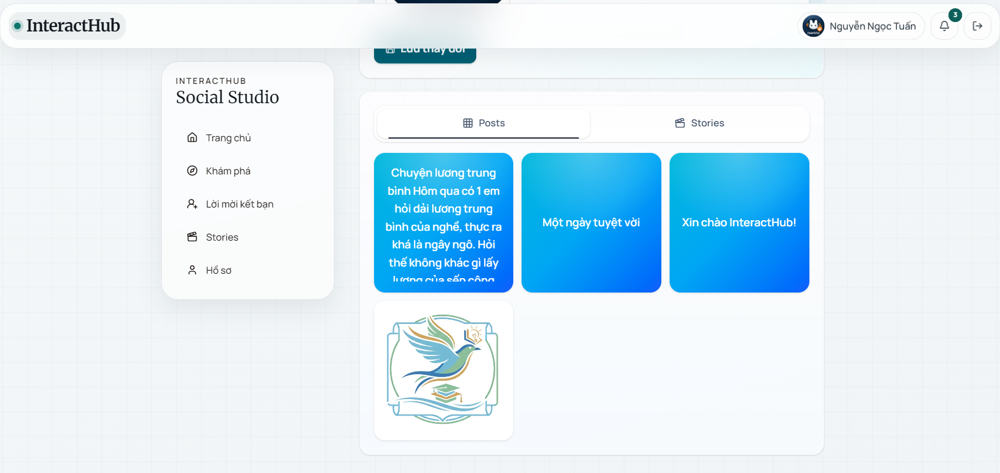

### Profile and Social
- Profile

  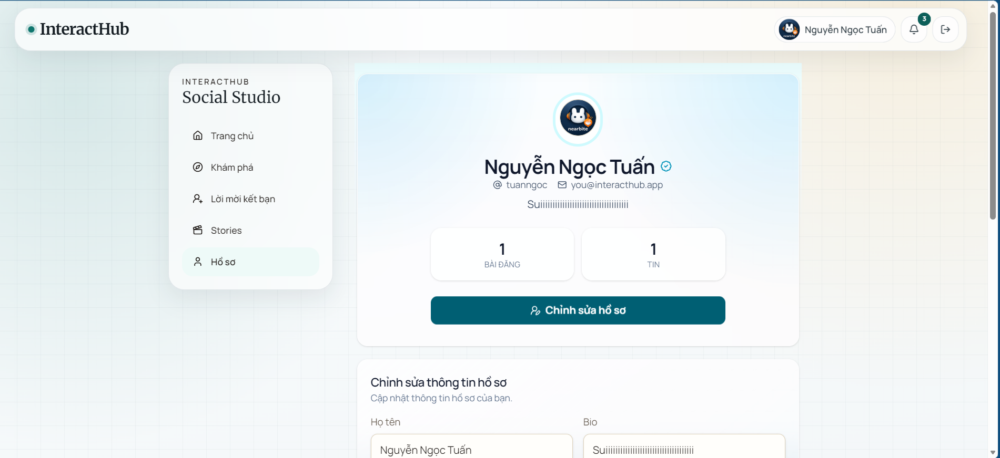

- Profile responsive

  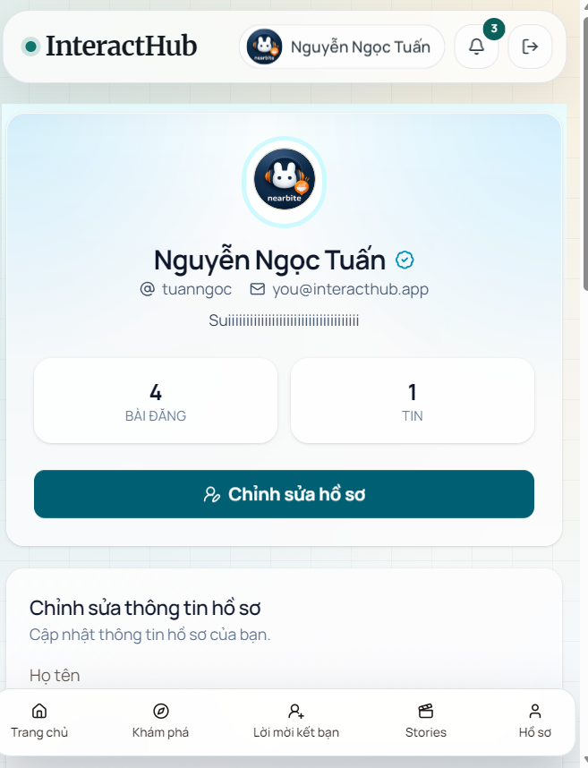

- Edit profile

  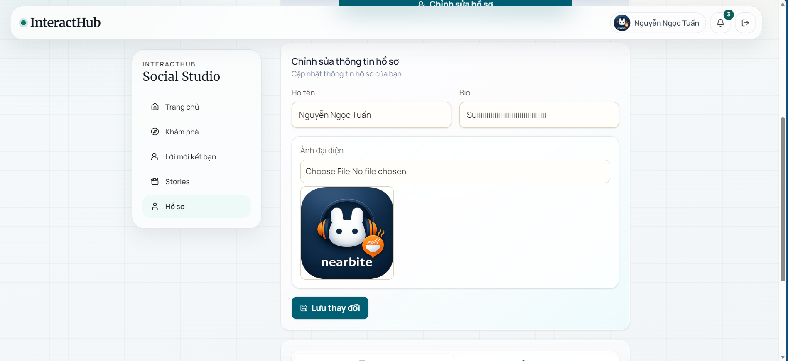

- Explore

  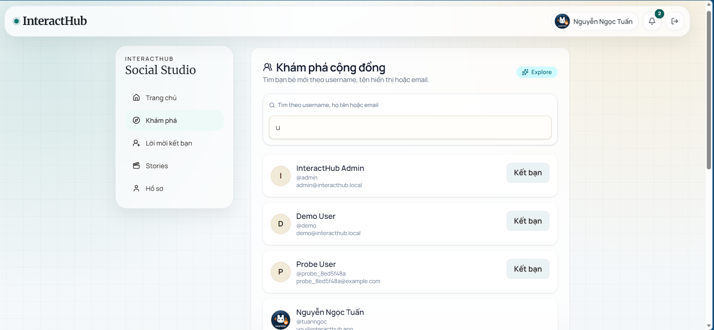

- Friend requests

  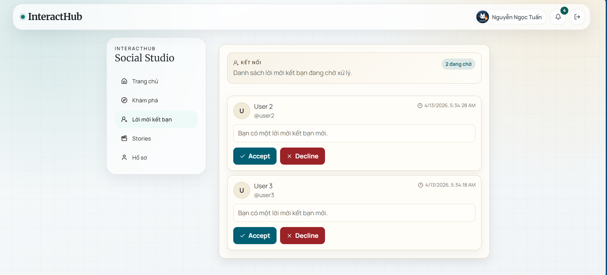

- Friend list

  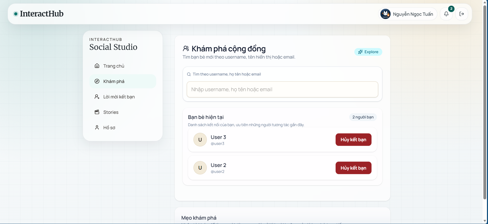

### Realtime and Stories
- Notifications

  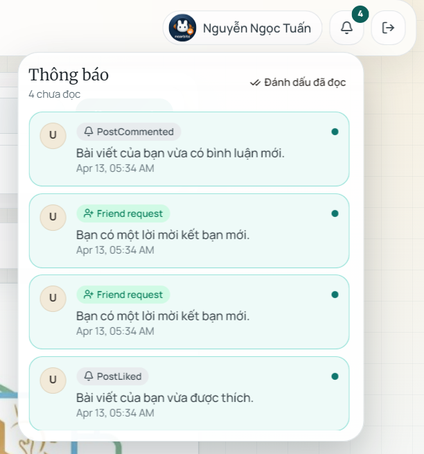

- Story page

  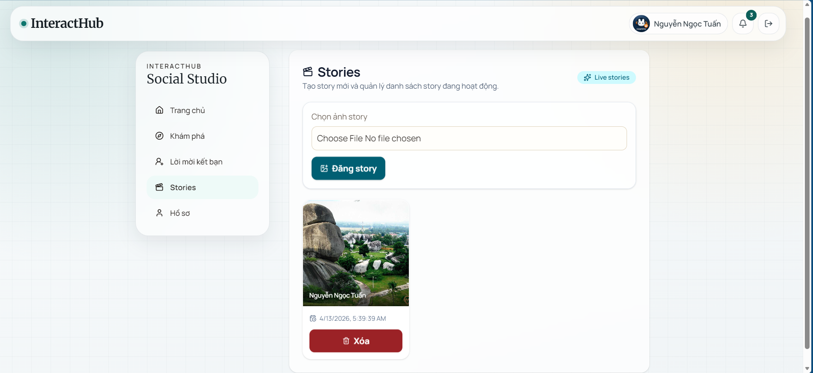

## Setup and Installation

### Prerequisites

- .NET SDK 8.0+
- Node.js 20+
- SQL Server (or LocalDB)

### Clone and Restore

```bash
git clone <your-repository-url>
cd InteractHub
```

### Backend Setup (InteractHub.API)

1. Update connection string in `InteractHub.API/appsettings.json` if needed.
2. Restore and run API:

```bash
cd InteractHub.API
dotnet restore
dotnet run
```

Default API URLs (from launch settings):
- http://localhost:5191
- https://localhost:7298

Swagger UI:
- http://localhost:5191/swagger
- https://localhost:7298/swagger

### Frontend Setup (interacthub-client)

1. Open a new terminal and run:

```bash
cd interacthub-client
npm install
npm run dev
```

2. Optional environment variable (`interacthub-client/.env`):

```env
VITE_API_BASE_URL=http://localhost:5191/api
```

Default frontend URL:
- http://localhost:5173

### Seed Data Behavior

On API startup, `DbSeeder` automatically applies migrations and inserts:
- Roles: User, Admin
- Default admin account: admin@interacthub.local
- Default demo account: demo@interacthub.local
- One initial sample post (if no posts exist)

## Database Diagram

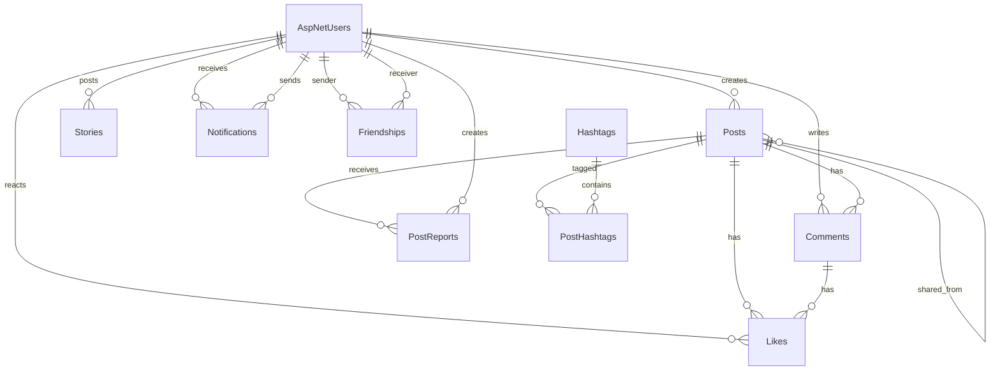

## API Endpoints

Base URL: `/api`

### Auth
- `POST /auth/register` - Register account.
- `POST /auth/login` - Login and receive JWT token.

### Users (Authorized)
- `GET /users/{id}` - Get user profile.
- `PUT /users/{id}` - Update user profile.
- `GET /users/search?q={keyword}&page={n}&pageSize={n}` - Search users.

### Posts (Authorized)
- `GET /posts?page={n}&pageSize={n}` - Get feed.
- `GET /posts/{id}` - Get post by id.
- `POST /posts` - Create post.
- `PUT /posts/{id}` - Update post.
- `DELETE /posts/{id}` - Delete post.
- `POST /posts/{id}/like` - Toggle like on post.
- `POST /posts/{id}/comments` - Add comment.
- `POST /posts/{id}/share` - Share post.
- `POST /posts/{id}/report` - Report post.

### Friends (Authorized)
- `POST /friends/request/{userId}` - Send friend request.
- `PUT /friends/accept/{userId}` - Accept request.
- `PUT /friends/decline/{userId}` - Decline request.
- `DELETE /friends/{userId}` - Remove friend.
- `GET /friends` - Get friend list.
- `GET /friends/status/{userId}` - Get friendship status.

### Stories (Authorized)
- `GET /stories` - Get active stories.
- `POST /stories` - Create story.
- `DELETE /stories/{id}` - Delete story.

### Notifications (Authorized)
- `GET /notifications` - List notifications.
- `PUT /notifications/{id}/read` - Mark one notification as read.
- `PUT /notifications/read-all` - Mark all notifications as read.

### Hashtags (Authorized)
- `GET /hashtags/trending?top={n}` - Get trending hashtags.

### Uploads (Authorized)
- `POST /uploads/image` - Upload image (multipart/form-data, max 5MB).

### Admin (Admin role required)
- `GET /admin/reports` - Get post reports.
- `PUT /admin/reports/{id}/resolve` - Resolve report.
- `DELETE /admin/posts/{id}` - Remove post as admin.

### SignalR Hub
- `GET /hubs/notifications` - Notification hub endpoint (JWT required).

## Database Deliverables

### SQL Script for Database Creation

- `docs/database/create-database.sql`

Generated from EF migrations by command:

```bash
cd InteractHub.API
dotnet ef migrations script 0 --output ../docs/database/create-database.sql
```

### Entity Framework Migration Files

- `InteractHub.API/Data/Migrations/20260331040119_InitialCreate.cs`
- `InteractHub.API/Data/Migrations/20260331040134_SeedRoles.cs`
- `InteractHub.API/Data/Migrations/20260331040146_AddIndexes.cs`
- `InteractHub.API/Data/Migrations/20260331040235_FixCascadeDeletePaths.cs`
- `InteractHub.API/Data/Migrations/AppDbContextModelSnapshot.cs`

### Seed Data Script

- `docs/database/seed-data.sql`

## Testing

### Test Project With All Test Cases

- Test project: `InteractHub.Test/InteractHub.Test.csproj`
- Covered service test suites:
  - `InteractHub.Test/Services/AdminServiceTests.cs`
  - `InteractHub.Test/Services/AuthServiceTests.cs`
  - `InteractHub.Test/Services/FriendsServiceTests.cs`
  - `InteractHub.Test/Services/HashtagServiceTests.cs`
  - `InteractHub.Test/Services/JwtTokenServiceTests.cs`
  - `InteractHub.Test/Services/NotificationsServiceTests.cs`
  - `InteractHub.Test/Services/PostsServiceTests.cs`
  - `InteractHub.Test/Services/StoriesServiceTests.cs`
  - `InteractHub.Test/Services/UsersServiceTests.cs`

### Test Coverage Report

- Coverage artifact (Cobertura): `docs/testing/coverage.cobertura.xml`
- Current summary:
  - Line coverage: 13.14% (746/5674)
  - Branch coverage: 20.30% (67/330)

### Test Execution Results

- Test result artifact: `docs/testing/test-results.trx`
- Detailed report: `docs/testing/testing-report.md`
- Current run summary:
  - Total tests: 35
  - Passed: 35
  - Failed: 0
  - Duration: 11.8s

## Deployment

### Live Application URL

- https://nice-wave-00bd20700.7.azurestaticapps.net/

### CI/CD Pipeline Configuration

- Pipeline workflow: `.github/workflows/azure-deploy.yml`
- Main jobs:
  - `build-and-test`
  - `deploy-api`
  - `deploy-frontend`
- Trigger:
  - Push to `main`/`master`
  - Manual run via `workflow_dispatch`

### Deployment Documentation

- Deployment guide: `docs/deployment/deployment-azure.md`

### Azure Resource List and Configuration

- Azure resource list (dedicated): `docs/azure-resource-list.md`
- Detailed deployment configuration: `docs/deployment/deployment-azure.md`
- Note: Subscription-level item is excluded from the resource inventory; only project resources are listed.

## Submission Checklist

- README with setup instructions and screenshots.
- Database diagram.
- API endpoints documentation.
- SQL database creation script.
- EF migration files.
- Seed data script.
- Testing:
  - Test project with all test cases.
  - Test coverage report.
  - Test execution results.
- Deployment:
  - Live application URL.
  - CI/CD pipeline configuration.
  - Deployment documentation.
  - Azure resource list and configuration.
