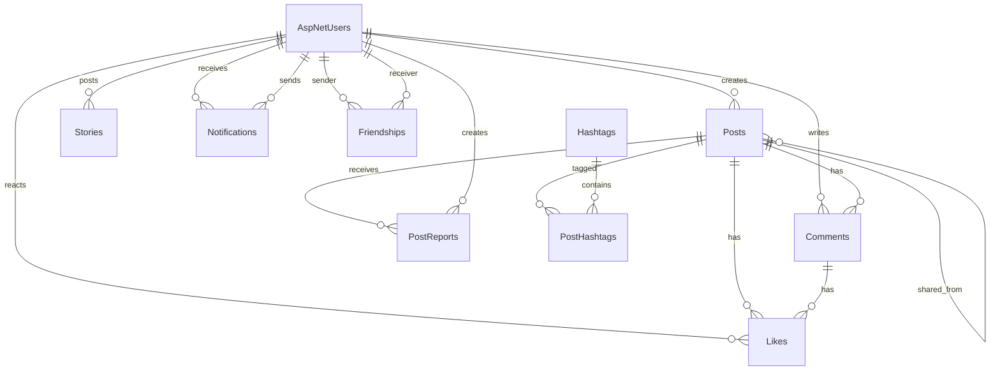

# InteractHub - Project Deliverables

InteractHub is a full-stack social networking project built with ASP.NET Core Web API and React + TypeScript.

## 1. Project Overview

### Core Features
- User registration and login with JWT authentication.
- Profile view and profile update.
- News feed with pagination.
- Create, update, delete, like, comment, share, and report posts.
- Friend request flow (send, accept, decline, remove).
- Story posting and story expiration flow.
- Notifications and real-time updates with SignalR.
- Admin moderation endpoints for reports and post removal.
- Image upload endpoint for media attachments.

### Tech Stack
- Backend: ASP.NET Core 8 Web API, Entity Framework Core, ASP.NET Identity, SQL Server, SignalR.
- Frontend: React 18, TypeScript, Vite, React Query, React Router.
- Auth: JWT Bearer.

## 2. Screenshots (Collected in interacthub-client/src/assets)

> Source folder: interacthub-client/src/assets

### Authentication
- Sign In

  

- Register

  

### Home and Feed
- Hero section

  

- Homepage

  

- Homepage responsive

  

- Single post

  

- Post grid

  

### Profile and Social
- Profile

  

- Profile responsive

  

- Edit profile

  

- Explore

  

- Friend requests

  

- Friend list

  

### Realtime and Stories
- Notifications

  

- Story page

  

## 3. Setup and Installation

## Prerequisites
- .NET SDK 8.0+
- Node.js 20+
- SQL Server (or LocalDB)

## Clone and Restore
```bash
git clone <your-repository-url>
cd InteractHub
```

## Backend Setup (InteractHub.API)
1. Update connection string in `InteractHub.API/appsettings.json` if needed.
2. Restore and run API:

```bash
cd InteractHub.API
dotnet restore
dotnet run
```

Default API URLs (from launch settings):
- http://localhost:5191
- https://localhost:7298

Swagger UI:
- http://localhost:5191/swagger
- https://localhost:7298/swagger

## Frontend Setup (interacthub-client)
1. Open a new terminal and run:

```bash
cd interacthub-client
npm install
npm run dev
```

2. Optional environment variable (`interacthub-client/.env`):

```env
VITE_API_BASE_URL=http://localhost:5191/api
```

Default frontend URL:
- http://localhost:5173

## Seed Data Behavior
- On API startup, `DbSeeder` automatically applies migrations and inserts:
  - Roles: User, Admin
  - Default admin account: admin@interacthub.local
  - Default demo account: demo@interacthub.local
  - One initial sample post (if no posts exist)

## 4. Database Diagram



## 5. API Endpoints List

Base URL: `/api`

### Auth
- `POST /auth/register` - Register account.
- `POST /auth/login` - Login and receive JWT token.

### Users (Authorized)
- `GET /users/{id}` - Get user profile.
- `PUT /users/{id}` - Update user profile.
- `GET /users/search?q={keyword}&page={n}&pageSize={n}` - Search users.

### Posts (Authorized)
- `GET /posts?page={n}&pageSize={n}` - Get feed.
- `GET /posts/{id}` - Get post by id.
- `POST /posts` - Create post.
- `PUT /posts/{id}` - Update post.
- `DELETE /posts/{id}` - Delete post.
- `POST /posts/{id}/like` - Toggle like on post.
- `POST /posts/{id}/comments` - Add comment.
- `POST /posts/{id}/share` - Share post.
- `POST /posts/{id}/report` - Report post.

### Friends (Authorized)
- `POST /friends/request/{userId}` - Send friend request.
- `PUT /friends/accept/{userId}` - Accept request.
- `PUT /friends/decline/{userId}` - Decline request.
- `DELETE /friends/{userId}` - Remove friend.
- `GET /friends` - Get friend list.
- `GET /friends/status/{userId}` - Get friendship status.

### Stories (Authorized)
- `GET /stories` - Get active stories.
- `POST /stories` - Create story.
- `DELETE /stories/{id}` - Delete story.

### Notifications (Authorized)
- `GET /notifications` - List notifications.
- `PUT /notifications/{id}/read` - Mark one notification as read.
- `PUT /notifications/read-all` - Mark all notifications as read.

### Hashtags (Authorized)
- `GET /hashtags/trending?top={n}` - Get trending hashtags.

### Uploads (Authorized)
- `POST /uploads/image` - Upload image (multipart/form-data, max 5MB).

### Admin (Admin role required)
- `GET /admin/reports` - Get post reports.
- `PUT /admin/reports/{id}/resolve` - Resolve report.
- `DELETE /admin/posts/{id}` - Remove post as admin.

### SignalR Hub
- `GET /hubs/notifications` - Notification hub endpoint (JWT required).

## 6. Database Deliverables

### SQL Script for Database Creation
- `docs/database/create-database.sql`

Generated from EF migrations by command:
```bash
cd InteractHub.API
dotnet ef migrations script 0 --output ../docs/database/create-database.sql
```

### Entity Framework Migration Files
- `InteractHub.API/Data/Migrations/20260331040119_InitialCreate.cs`
- `InteractHub.API/Data/Migrations/20260331040134_SeedRoles.cs`
- `InteractHub.API/Data/Migrations/20260331040146_AddIndexes.cs`
- `InteractHub.API/Data/Migrations/20260331040235_FixCascadeDeletePaths.cs`
- `InteractHub.API/Data/Migrations/AppDbContextModelSnapshot.cs`

### Seed Data Script
- `docs/database/seed-data.sql`

## 7. Submission Checklist
- README with setup instructions and screenshots: completed.
- Database diagram: completed.
- API endpoints documentation: completed.
- SQL database creation script: completed.
- EF migration files: included in project.
- Seed data script: completed.
